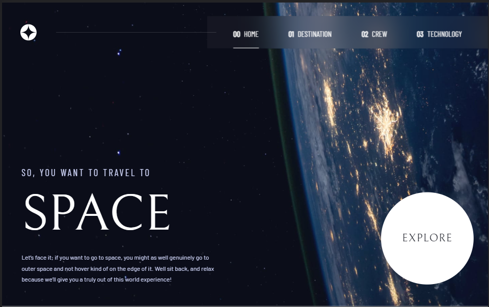
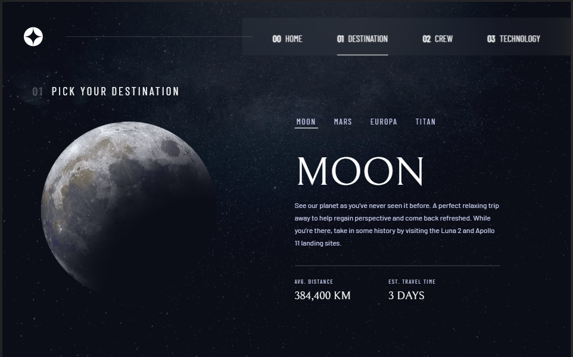
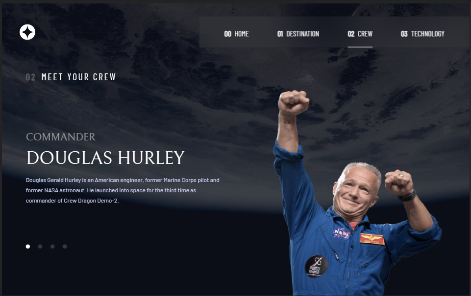
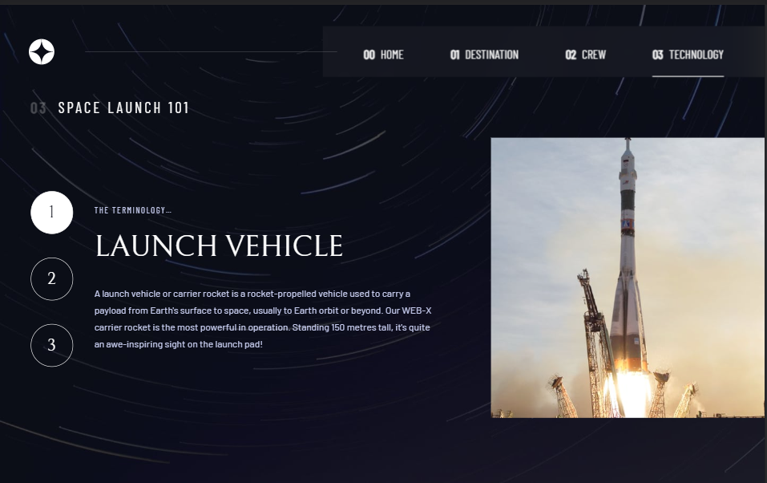

# Frontend Mentor - Space tourism website solution

This is a solution to the [Space tourism website challenge on Frontend Mentor](https://www.frontendmentor.io/challenges/space-tourism-multipage-website-gRWj1URZ3). Frontend Mentor challenges help you improve your coding skills by building realistic projects.

## Table of contents

- [Overview](#overview)
  - [The challenge](#the-challenge)
  - [Screenshot](#screenshot)
  - [Links](#links)
- [My process](#my-process)
  - [Built with](#built-with)
  - [What I learned](#what-i-learned)
  - [Continued development](#continued-development)
- [Author](#author)
- [Acknowledgments](#acknowledgments)

## Overview

### The challenge

Users should be able to:

- View the optimal layout for each of the website's pages depending on their device's screen size
- See hover states for all interactive elements on the page
- View each page and be able to toggle between the tabs to see new information

### Screenshot






### Links

- Solution URL: [SOLUTION URL](https://www.frontendmentor.io/challenges/space-tourism-multipage-website-gRWj1URZ3/hub)
- Live Site URL: [LIVE SITE URL](https://olu-space-tourism.netlify.app/)

## My process

I started by going through the designs and trying to create my workflow. Then I constructed elements with static content and imported the contents of the dynamic ones from the state where I stored the JSON file, styled and added the required functionality. It was a challenging project for me as it was the first time I was using react-router nonetheless, I enjoyed the overall experience.

### Built with

- [SASS](https://sass-lang.com/) - CSS preprocessor
- Flexbox
- Mobile-first workflow
- [React](https://reactjs.org/) - JS library
- npm packages

### What I learned

I used this snippet to manage the routing between pages and add the active class to whichever page is currently displayed.

```js
function CustomLink({ to, children, ...props }) {
  const resolvedPath = useResolvedPath(to);
  const isActive = useMatch({ path: resolvedPath.pathname, end: true });

  return (
    <li className={isActive ? "active" : ""}>
      <Link to={to} {...props}>
        {children}
      </Link>
    </li>
  );
}
```

I used this snippet to change the image orientation based on the view width with the aid of useEffect and useState.

```js
const [technologyImg, setTechnologyImg] = useState([
  launchVehicleImgLS,
  spacePortImgLS,
  spaceCapsuleImgLS,
]);
useEffect(() => {
  const handleWindowResize = () => {
    if (window.innerWidth > 1000) {
      setTechnologyImg([launchVehicleImgPT, spacePortImgPT, spaceCapsuleImgPT]);
    } else {
      setTechnologyImg([launchVehicleImgLS, spacePortImgLS, spaceCapsuleImgLS]);
    }
  };

  window.addEventListener("resize", handleWindowResize);
  return () => {
    window.removeEventListener("resize", handleWindowResize);
  };
}, []);
```

### Continued development

I'd like to use react router more in the nearest future as this is my first implementation of it.

## Author

- Website - [PORTFOLIO WEBSITE](https://oludare.netlify.app/)
- Frontend Mentor - [@Michaelhybrid](https://www.frontendmentor.io/profile/Michaelhybrid)
- Twitter - [@theHybridCoder](https://www.twitter.com/theHybridCoder)

## Acknowledgments

To God be the Glory!
